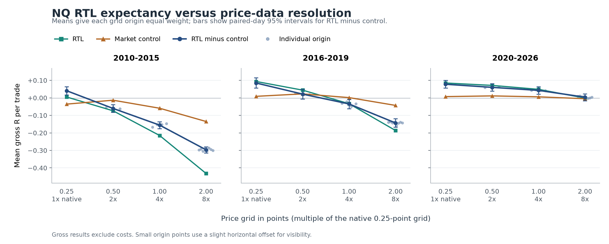

# NQ price resolution: fixed grids and every origin

2026-10-09. Follow-up to [NQ versus ES](../nq-vs-es/RESULTS.md); [recorded protocol](PROTOCOL.md).

**Widening NQ's price-data grid progressively reduces RTL's advantage over the every-bar market-buy control in all three periods.** The direction survives every tested grid origin. In 2020-26 the gross strategy contrast falls from +0.0777 R on native prices to +0.0600, +0.0427 and +0.0038 R on 0.50-, 1.00- and 2.00-point grids. The widest grid removes about 95% of the native contrast; its remaining contrast has an interval spanning zero.

This is stronger evidence of resolution sensitivity than the earlier single yearly-grid experiment. It supports price resolution relative to candle width as an important candidate explanation for the NQ/ES difference. This experiment alone cannot determine how much of ES's weakness it explains or which entry/exit mechanism is responsible.

## What was run

All **30 MT5 jobs** completed: 15 price histories, each tested with RTL red cap3 and the market-buy control. The control buys on each eligible M30 bar while flat, regardless of candle colour. The contrast compares these two complete strategies.

| Data grid | Multiple of native | Origins, in points | Strategy runs |
|---|---:|---|---:|
| 0.25 points | 1x | 0 (original NQ symbol) | 2 |
| 0.50 points | 2x | 0, 0.25 | 4 |
| 1.00 points | 4x | 0, 0.25, 0.50, 0.75 | 8 |
| 2.00 points | 8x | 0, 0.25, ..., 1.75 | 16 |

Each M1 open, high, low and close was rounded to the nearest permitted grid price, with exact halfway ties upward. Timestamps, volumes and spread were preserved. Synthetic symbols retain the original **0.25-point trade tick and $2/point**. The intervention changes the prices available in the data, rather than simulating an exchange that changed its tick size.

Settings stayed at M30, tester Model1 (M1 OHLC), RR1 bar-close market exit, one lot, existing trade windows, early-close calendar and session flatten/fallback. Test FromDate is 2010-06-07; MT5's exclusive ToDate is 2026-07-14, so the final tested day is July 13. Automatic warmup makes June 10 the first trading day. No parameters or candle filters were tuned.



## Gross expectancy

Values below are **equal-weight averages of origin-level means**, not pooled trades or a portfolio combining origins. R is profit divided by the recorded stop-risk distance times $2/point. Gross results exclude costs. The last column compares RTL-minus-control with native RTL-minus-control; brackets are paired-day 95% intervals.

| Period | Grid, points | Origins | RTL R/trade | Control R/trade | RTL minus control | Contrast 95% interval | Change vs native (95% interval) |
|---|---:|---:|---:|---:|---:|---|---|
| 2010-15 | 0.25 | 1 | +0.0049 | -0.0358 | +0.0407 | [+0.0175, +0.0639] | +0.0000 (native) |
| 2010-15 | 0.50 | 2 | -0.0739 | -0.0135 | -0.0605 | [-0.0827, -0.0391] | -0.1011 ([-0.1129, -0.0894]) |
| 2010-15 | 1.00 | 4 | -0.2148 | -0.0592 | -0.1556 | [-0.1753, -0.1361] | -0.1962 ([-0.2137, -0.1802]) |
| 2010-15 | 2.00 | 8 | -0.4316 | -0.1350 | -0.2966 | [-0.3150, -0.2790] | -0.3373 ([-0.3593, -0.3161]) |
| 2016-19 | 0.25 | 1 | +0.0935 | +0.0087 | +0.0848 | [+0.0558, +0.1141] | +0.0000 (native) |
| 2016-19 | 0.50 | 2 | +0.0441 | +0.0227 | +0.0214 | [-0.0069, +0.0484] | -0.0634 ([-0.0747, -0.0525]) |
| 2016-19 | 1.00 | 4 | -0.0335 | +0.0014 | -0.0349 | [-0.0617, -0.0089] | -0.1197 ([-0.1368, -0.1033]) |
| 2016-19 | 2.00 | 8 | -0.1864 | -0.0431 | -0.1433 | [-0.1676, -0.1188] | -0.2281 ([-0.2507, -0.2065]) |
| 2020-26 | 0.25 | 1 | +0.0848 | +0.0071 | +0.0777 | [+0.0562, +0.1003] | +0.0000 (native) |
| 2020-26 | 0.50 | 2 | +0.0712 | +0.0112 | +0.0600 | [+0.0389, +0.0818] | -0.0177 ([-0.0217, -0.0134]) |
| 2020-26 | 1.00 | 4 | +0.0485 | +0.0059 | +0.0427 | [+0.0216, +0.0635] | -0.0351 ([-0.0417, -0.0282]) |
| 2020-26 | 2.00 | 8 | -0.0011 | -0.0050 | +0.0038 | [-0.0161, +0.0233] | -0.0739 ([-0.0842, -0.0636]) |
| all | 0.25 | 1 | +0.0581 | -0.0073 | +0.0654 | [+0.0512, +0.0800] | +0.0000 (native) |
| all | 0.50 | 2 | +0.0118 | +0.0056 | +0.0062 | [-0.0069, +0.0200] | -0.0592 ([-0.0648, -0.0536]) |
| all | 1.00 | 4 | -0.0676 | -0.0175 | -0.0502 | [-0.0630, -0.0372] | -0.1155 ([-0.1238, -0.1077]) |
| all | 2.00 | 8 | -0.2005 | -0.0589 | -0.1416 | [-0.1537, -0.1290] | -0.2069 ([-0.2182, -0.1957]) |

Both RTL expectancy and its contrast with the control decline in order as the grid widens. Every coarse origin's change from native has a paired 95% interval below zero. The origin-level ranges also remain separated across successive grids:

| Period | 0.50-point contrast range | 1.00-point contrast range | 2.00-point contrast range |
|---|---:|---:|---:|
| 2010-15 | -0.0629 to -0.0580 | -0.1680 to -0.1477 | -0.3055 to -0.2873 |
| 2016-19 | +0.0182 to +0.0246 | -0.0500 to -0.0232 | -0.1587 to -0.1366 |
| 2020-26 | +0.0584 to +0.0615 | +0.0403 to +0.0455 | -0.0035 to +0.0103 |

For 2020-26, the widest-grid contrast loss is **-0.0739 R**, interval **[-0.0842, -0.0636]**. RTL itself falls +0.0848 to -0.0011 R; control falls +0.0071 to -0.0050 R. The control therefore changes too, but RTL deteriorates much more. In the older periods the control deteriorates substantially at the widest grids; the earlier suggestion that it stays unchanged does not hold generally.

## Why candle width and tick size are different questions

The most useful comparison keeps NQ's underlying history and roughly the same candle widths while reducing the number of distinct steps inside those candles. For executed RTL trades in 2020-26:

| Data grid | Mean of origin median risk widths, points | Mean of origin median grid steps across that width | Gross RTL R/trade |
|---|---:|---:|---:|
| 0.25 | 27 | 108 | +0.0848 |
| 0.50 | 27 | 54 | +0.0712 |
| 1.00 | 27 | 27 | +0.0485 |
| 2.00 | 28 | 14 | -0.0011 |

A 27-point candle has 108 quarter-point intervals, 54 half-point intervals, or 27 one-point intervals. Its physical width can stay almost the same while its recorded price resolution changes sharply. These are **grid steps**; counting inclusive price levels would add one.

For two instruments with a 0.25-point native tick, the relevant ratio is `(high - low) / 0.25`, rather than equal tick size alone. Their different quoted levels and percentage moves can produce different point widths, hence different ticks per candle. Dollar value per point is another quantity: it changes dollar exposure and costs relative to risk, rather than this step count.

Earlier NQ candles are much narrower: native executed RTL median widths are 3.75 points/15 steps in 2010-15, 7.25 points/29 steps in 2016-19, and 27 points/108 steps in 2020-26. A fixed 2-point grid consumes a much larger fraction of the earlier candles. The stronger historical deterioration is consistent with that explanation, although period differences also involve different market behaviour and trade populations. This does **not** establish a universal 30-tick cutoff or any new trading rule.

## Signal populations also change

Rounding can turn red or green candles into dojis, tie highs/lows and break red runs. The source diagnostics quantify these changes before accounting for occupied positions or pending orders. For 2020-26, averaging counts across origins:

| Grid, points | Median source M30 width, points | Source M30 dojis | Static red-cap3 eligible bars | Native-eligible bars lost | Eligible bars gained |
|---|---:|---:|---:|---:|---:|
| 0.25 | 29.25 | 670 | 32,446 | 0 | 0 |
| 0.50 | 29 | 1,219.5 | 32,267.5 | 268 | 89.5 |
| 1.00 | 29 | 2,282.5 | 31,919 | 756.3 | 229.3 |
| 2.00 | 30 | 4,375.4 | 31,226.4 | 1,706.9 | 487.3 |

Fractional counts are averages of whole counts from different origins. Static eligibility is not a trade count. Gained eligibility can occur when a new doji interrupts a previously over-cap red run. Rounding also changes stops, triggering, time spent flat and the synthetic M1 replay path. We have established sensitivity to this bundle; the result does not isolate one mechanism.

## Trades and costs: recent period

Secondary figures apply the existing fixed **$1.05 per trade** to complete ledgers. These are descriptive equal-origin means; the runs are alternative scenarios.

| Grid, points | RTL trades | RTL win rate | RTL net R/trade | RTL net dollars | Control trades | Control win rate | Control net R/trade |
|---|---:|---:|---:|---:|---:|---:|---:|
| 0.25 | 9,271 | 43.08% | +0.0599 | +$37,981 | 14,866 | 42.01% | -0.0133 |
| 0.50 | 9,307.5 | 42.70% | +0.0463 | +$33,140 | 14,769.5 | 42.07% | -0.0092 |
| 1.00 | 9,372 | 42.01% | +0.0237 | +$24,400 | 14,796 | 41.69% | -0.0145 |
| 2.00 | 9,527 | 40.52% | -0.0259 | +$6,718 | 14,843.3 | 40.97% | -0.0254 |

Positive dollar totals can coexist with negative mean R because these one-lot tests expose different dollar risk on different trades. The primary resolution result uses mean gross R. Per-origin metrics, drawdowns, all periods and yearly figures are saved in the tables below.

## Ledger audit and verification

Native **raw** RTL and control CSVs reproduce the previous signal-colour study byte for byte: 23,427 and 35,800 logged trades. Reconciliation with complete tester reports then exposed a collection defect: the EA starts tracking on a later OnTick, so a market position that opens and stops before that tick can be omitted from its CSV.

The native control actually has **35,872 trades**. Its 72 missing positions all lose 1R, totalling -$1,465. Recovering them changes control gross means to -0.0358, +0.0087 and +0.0071 R across the three periods. Native RTL needs no additions. This explains the small difference from the earlier reported control means; the native strategy replay itself is unchanged.

Across all runs, **2,321 omitted control positions** were recovered from original tester orders and deals. The original buy-order requested price minus its SL reproduces the risk of every already-logged position; that same definition supplies risk for recovered positions. Raw files and original row fields are preserved. Recovered excursions and signal labels remain unknown/NaN and are unused here. All 30 complete ledgers reconcile tester trade counts, profit, gross gains and gross losses exactly within the stated $0.000001 tolerance.

The source checks cover 5,433,425 M1 rows, 189,168 M30 bars and 4,145 source-session dates. Yearly imported counts, timestamp spans and native OHLC price sums match the source CSV; copied symbol properties, OHLC ordering, grid membership, positive trade risk, point value and frozen input hashes pass. All completion markers and raw output hashes pass. Control orders/fills belong to the same M30 bar, though the first generated tick can arrive after its nominal boundary. Exact-boundary control entries fall from 95.0% on native data to about 77% at the widest grid; this is another replay-path effect bundled into the perturbation.

## What this permits us to conclude

RTL's relative performance is strongly sensitive to price-data resolution in this tester. The direction is consistent across the fixed grids, every origin and each era. The result makes the granularity hypothesis more credible and supports proceeding to the separate post-entry path decomposition.

A precise NQ-versus-ES attribution still needs that path study and the same ledger audit applied to the older ES and yearly-coarse reports. This experiment did not rerun ES. The former study used NumPy ties-to-even rounding; this study uses nearest halfway-up rounding. Results at overlapping grid sizes need not reproduce the former coarsening, and invariance to rounding rules has not been tested.

Intervals use 2,000 common resamples of whole entry days within each period, including zero-trade source days, with seed 20261009 plus period index. Each sample recomputes total R / total trades, and averages origin-level contrasts equally while preserving covariance across origins and native. Origins reuse the same history and are not independent replications. The intervals do not cover dependence spanning multiple days, multiple-comparison selection or broader research selection. This is an exploratory sensitivity study, without an independent out-of-sample claim.

The synthetic histories and M1 OHLC tester cannot reproduce ES's order book or establish that its true price paths share this mechanism. A separate path experiment should collect complete excursions for fast-stop trades; the recovered rows here cannot supply those missing paths. No strategy filter or parameter change is adopted.

## Artifacts and reproduction

- [Preparation and frozen design](../../../python/prepare_granularity.py), [MT5 runner/import checks](../../../python/run_granularity.py).
- [Source candle diagnostics](../../../python/analyze_granularity_candles.py), [complete-ledger audit](../../../python/audit_granularity_ledgers.py), [paired analysis](../../../python/analyze_granularity.py), [figure](../../../python/plot_granularity.py).
- [Manifest](../../../Reports/granularity_20261009/manifest.json), [analysis checks](../../../Reports/granularity_20261009/analysis_checks.json), [generated analysis with every origin](../../../Reports/granularity_20261009/ANALYSIS.md).
- [Trade metrics](../../../Reports/granularity_20261009/summary.csv), [paired contrasts](../../../Reports/granularity_20261009/contrast.csv), [traded candle resolution](../../../Reports/granularity_20261009/resolution.csv), [source candle diagnostics](../../../Reports/granularity_20261009/candle_diagnostics.csv), [yearly metrics](../../../Reports/granularity_20261009/yearly.csv), [aligned daily totals](../../../Reports/granularity_20261009/daily.csv).
- [PNG](expectancy-by-grid.png) and [SVG](expectancy-by-grid.svg). The Reports folder is local and gitignored; configs, reports, raw/audited ledgers and per-job provenance remain there.

From the project root, with the existing MT5 installation and source history:

```powershell
# Only for a fresh study directory; refuses to overwrite the frozen manifest.
& .\venv\Scripts\python.exe python/prepare_granularity.py
# Resumes existing completed jobs and validates their hashes.
& .\venv\Scripts\python.exe python/run_granularity.py
& .\venv\Scripts\python.exe python/analyze_granularity.py
& .\venv\Scripts\python.exe python/plot_granularity.py
```
