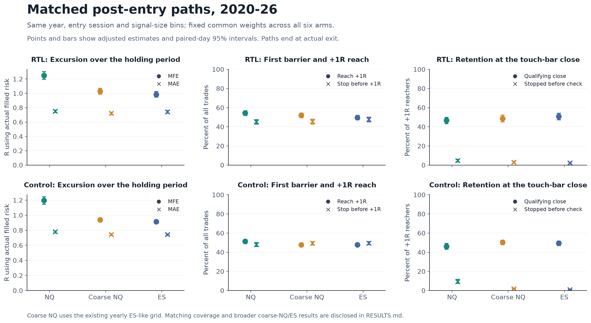
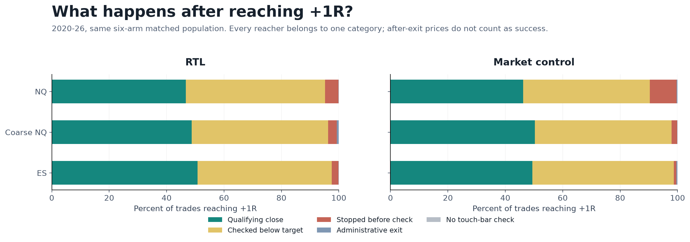

# NQ, coarsened NQ and ES: complete post-entry paths

2026-10-09. Follow-up to [resolution across fixed grids](../granularity/RESULTS.md) and [NQ versus ES](../nq-vs-es/RESULTS.md). [Recorded protocol](PROTOCOL.md).

**The recent, broad candle-size-matched comparison points to ES reaching +1R less often and stopping first more often than coarsened NQ. It does not show poorer conversion of a +1R touch into a qualifying M30 close on ES.** That pattern appears in both RTL and the every-bar market-buy control.

This finding is conditional on the comparison population. Matching all three instruments leaves a narrow recent population and removes the clear coarse-NQ/ES control-expectancy gap there. Matching by ordinary quarter-point ticks also weakens several differences. The results narrow the path explanation; they do not establish a complete causal attribution to granularity or market behaviour.

All six instrumented MT5 runs reproduce their original raw trade ledgers and complete audited trades. There are **180,130 complete position paths**, including all 275 control trades previously omitted by the CSV logger. Every path starts at the actual entry quote with zero delay and ends at the actual exit.

## Comparable candles and what R means

All symbols have a 0.25-point trade tick. Native NQ and ES also use 0.25-point price-data steps. The existing coarse-NQ history uses a larger yearly data grid: 0.50 points in 2010-16, 0.75 in 2017-19, 1.00 in 2020-23, 1.25 in 2024-25 and 1.50 in 2026. It is the original ES-like, ties-to-even history, rather than one of the newer fixed-grid/origin histories.

Matching a candle's **range divided by its data-grid step** compares its number of price steps. A 20-point coarse-NQ candle on a 1-point grid and a 5-point ES candle on a 0.25-point grid each span 20 steps. They match on that measure despite different point ranges. Matching in ordinary ticks asks a different question: equal point ranges, because every tick is 0.25 points. Nominal index price is not a matching variable.

The frozen cells are entry year x entry session x signal-range/step bin: [0,8), [8,16), [16,24), [24,32), [32,48), [48,64), [64,128), [128,infinity). The source clock is Chicago local time plus eight hours, with US DST; sessions are [01:00,16:30), [16:30,20:00), [20:00,23:30). A cell requires at least 30 trades and 10 entry days in every participating instrument/strategy arm. Each cell gets a fixed weight proportional to its minimum arm count. Both strategies use the same weights within a panel.

MAE is the largest adverse movement during the held position, expressed as a positive R amount; MFE is the largest favourable movement. Path R is actual fill minus original SL. Gross expectancy uses original requested entry minus SL to reproduce the preceding studies. There are no fill-versus-requested-risk differences in these six runs, so these R units coincide. Gross results exclude costs.

Stop-first means an actual SL exit before any +1R touch. Reaching +1R includes paths that later stop. Administrative exits that reach neither barrier are a separate outcome, so stop-first and +1R reach need not sum to 100%.

## Primary comparison across all three instruments

For 2020-26, the six-arm common population contains 20 year/session/size cells. These are adjusted estimates on that population, rather than whole-instrument results. Close percentages use all +1R reachers as their denominator.

| Strategy | Instrument | Gross R/trade | Mean MAE, R | Mean MFE, R | Reach +1R | SL before +1R | Touch-bar close >= target, among reachers | Eventually close >= target, among reachers |
| --- | --- | --- | --- | --- | --- | --- | --- | --- |
| RTL | NQ | +0.1024 | 0.753 | 1.249 | 54.34% | 45.29% | 46.68% | 73.35% |
| RTL | Coarse NQ | +0.0700 | 0.722 | 1.030 | 51.94% | 45.52% | 48.77% | 81.06% |
| RTL | ES | +0.0099 | 0.743 | 0.986 | 49.66% | 47.74% | 50.83% | 80.04% |
| Control | NQ | +0.0442 | 0.780 | 1.195 | 51.36% | 48.07% | 46.18% | 73.96% |
| Control | Coarse NQ | -0.0167 | 0.744 | 0.940 | 47.75% | 49.54% | 50.31% | 82.12% |
| Control | ES | -0.0046 | 0.743 | 0.915 | 47.80% | 49.52% | 49.43% | 84.50% |

Native NQ has the largest mean MFE in both strategies. Relative to coarse NQ, its MFE is higher by 0.219 R in RTL (95% interval [0.157, 0.286]) and 0.256 R in the control ([0.199, 0.308]). Its gross expectancy differences have intervals spanning zero in this narrow population. Native NQ does not have a higher conditional touch-bar qualifying-close rate; the control's is lower. A favourable excursion advantage therefore does not automatically imply better retention at the first close.

Coverage is a material limitation, especially in recent years:

| Instrument | Strategy | Eligible trades | Supported trades | Retained | Supported/eligible entry days |
| --- | --- | --- | --- | --- | --- |
| NQ | rtl | 9258 | 3053 | 32.98% | 1184/1686 |
| NQcoarse | rtl | 9386 | 1855 | 19.76% | 988/1686 |
| ES | rtl | 9615 | 1949 | 20.27% | 996/1686 |
| NQ | control | 14850 | 3690 | 24.85% | 1224/1686 |
| NQcoarse | control | 14789 | 4259 | 28.80% | 1435/1686 |
| ES | control | 15265 | 4252 | 27.85% | 1432/1686 |

Only 20-33% of recent trades survive this intersection. In particular, coarse-NQ control minus ES control is **-0.0121 R**, with a paired 95% interval **[-0.0479, +0.0242]**. The unadjusted plain-long gap cannot be assumed to persist in every comparable candle population. All six-arm recent cells are at least 24 effective steps wide; about 82% of its weight is at 32+ steps. In contrast, the broad four-arm panel places about 51% of its weight below 24 steps and 65% below 32. The control-gap disappearance describes a substantially larger-candle subset. The six-arm weights are 89.6% pre-cash and 10.4% early cash, with no supported late-cash cells; the broader panel is 79.9% pre-cash, 13.3% early cash and 6.8% late cash. These summaries therefore also differ in session composition.

## Broader coarsened-NQ versus ES comparison

The pre-specified four-arm panel has 73 recent cells and retains **84-87%** of eligible trades in each arm. It compares a broader population using its own fixed weights. Its numbers must not be mixed with the preceding six-arm numbers when computing differences.

| Strategy | Instrument | Gross R/trade | Mean MAE, R | Mean MFE, R | Reach +1R | SL before +1R | Touch-bar close >= target, among reachers | Eventually close >= target, among reachers |
| --- | --- | --- | --- | --- | --- | --- | --- | --- |
| RTL | Coarse NQ | +0.0435 | 0.738 | 1.060 | 49.86% | 46.58% | 47.83% | 77.43% |
| RTL | ES | -0.0014 | 0.749 | 1.020 | 48.22% | 48.26% | 47.60% | 77.07% |
| Control | Coarse NQ | -0.0004 | 0.754 | 1.031 | 47.19% | 48.66% | 47.92% | 77.34% |
| Control | ES | -0.0581 | 0.769 | 0.946 | 45.87% | 50.21% | 47.79% | 77.67% |

The following are **coarse NQ minus ES** paired contrasts, with 95% day-bootstrap intervals. Probability contrasts are percentage points (pp).

| Metric | RTL difference [95% interval] | Control difference [95% interval] |
| --- | --- | --- |
| Gross R/trade | +0.0449 [+0.0191, +0.0703] | +0.0577 [+0.0382, +0.0772] |
| Mean MAE, R | -0.0111 [-0.0188, -0.0037] | -0.0149 [-0.0204, -0.0095] |
| Mean MFE, R | +0.0404 [+0.0199, +0.0606] | +0.0855 [+0.0695, +0.1019] |
| Reach +1R, pp | +1.64 [+0.50, +2.75] | +1.32 [+0.45, +2.19] |
| Stop before +1R, pp | -1.69 [-2.75, -0.54] | -1.55 [-2.40, -0.69] |
| Touch-bar qualifying close \| reach, pp | +0.23 [-1.50, +2.24] | +0.13 [-1.46, +1.75] |
| Eventual qualifying close \| reach, pp | +0.36 [-1.09, +1.91] | -0.32 [-1.56, +0.87] |

ES's lower reach probability and greater stop-first probability are clearer than its post-touch retention differences. Both strategies also have smaller mean held-position MFE and slightly larger MAE on ES. These excursion means include the entire holding period, including movement after +1R; they are not solely pre-target measures.

Among RTL trades that eventually reach +1R, mean adverse excursion *before* the touch is almost the same: 0.363 R on coarse NQ versus 0.365 R on ES. For the control it is 0.378 versus 0.403 R. Thus the RTL evidence is more consistent with a modestly greater share failing to reach the target than with substantially deeper dips among the trades that do reach it. Conditioning on eventual reach selects survivors and cannot describe the stopped trades.

In this broad population, RTL minus control is +0.0439 R on coarse NQ [0.0185, 0.0716] and +0.0567 R on ES [0.0315, 0.0827]. ES still benefits from the full RTL strategy relative to the control, but starts from a weaker control result. These are full-strategy contrasts, not isolated causal estimates of the buy-stop entry.

## What happens after +1R is touched?

The primary close is the actual target-management evaluation closing the **same M30 bar as the first +1R touch**. A close equal to the target qualifies, matching the EA's >= rule. A stop or flatten before that check cannot be credited with a later source-bar close.

In the broad recent panel, about 48% of reachers qualify at that first close in both instruments and strategies. A similar share is checked below the target; about 3-4% stop before the check. The complete five-way split, including administrative exits and unavailable checks, is in the analysis tables. The figure below uses the narrower six-arm population, as labelled.

A below-target first close is not necessarily a permanent failure. Separately, about 77-78% of broad-panel reachers **eventually** have an actual qualifying close while still held. The coarse-NQ/ES differences in that secondary measure also have intervals spanning zero. This does not prove equivalence, but it gives no clear evidence that ES is worse at retaining a +1R touch into either the first or an eventual qualifying close in this recent broad population.

The eventual measure is a descriptive extension using the exported actual checks; it does not replace the protocol's primary same-bar outcome. A qualifying check records that the condition was satisfied, rather than certifying successful order submission. Hypothetical closes after exit are saved separately and never credited as retained target success.

## Earlier periods and size sensitivity

The broad four-arm comparisons below use each period's effective-step support. Again, differences are coarse NQ minus ES, with paired 95% intervals.

| Period | Strategy | Gross R difference | Reach +1R difference, pp | Touch-bar qualifying close \| reach difference, pp |
| --- | --- | --- | --- | --- |
| 2010-15 | rtl | -0.0022 [-0.0292, +0.0245] | +0.49 [-0.76, +1.69] | +3.86 [+1.53, +6.03] |
| 2010-15 | control | +0.1536 [+0.1332, +0.1742] | +4.51 [+3.55, +5.44] | +2.62 [+0.66, +4.60] |
| 2016-19 | rtl | +0.0441 [+0.0097, +0.0765] | +1.31 [-0.07, +2.63] | -0.47 [-3.00, +2.26] |
| 2016-19 | control | +0.1311 [+0.1039, +0.1592] | +3.36 [+2.16, +4.51] | -0.01 [-2.31, +2.36] |
| 2020-26 | rtl | +0.0449 [+0.0191, +0.0703] | +1.64 [+0.50, +2.75] | +0.23 [-1.50, +2.24] |
| 2020-26 | control | +0.0577 [+0.0382, +0.0772] | +1.32 [+0.45, +2.19] | +0.13 [-1.46, +1.75] |

The ES control's weaker gross expectancy appears in every era of this broad comparison. RTL's instrument gap is unclear in 2010-15 and positive in the two later eras. In 2010-15, ES also has a lower first-close conversion rate; the recent retention finding should not be generalized to every era. Eventual conversion differences are less clear.

The native-quarter-tick sensitivity matches signal range / 0.25 for all instruments. Recent support shrinks to 20 cells and retains only 20-33% of trades, including in the four-arm panel. It therefore changes both the candle-size question and the supported population:

| Coarse NQ minus ES, ordinary-tick matching | RTL [95% interval] | Control [95% interval] |
| --- | --- | --- |
| Gross R/trade | +0.0079 [-0.0810, +0.0926] | +0.0436 [-0.0335, +0.1108] |
| Mean MAE, R | +0.0257 [+0.0029, +0.0496] | +0.0378 [+0.0215, +0.0559] |
| Mean MFE, R | +0.1615 [+0.0987, +0.2236] | +0.2911 [+0.2321, +0.3454] |
| Reach +1R, pp | +1.48 [-2.01, +4.45] | +1.44 [-1.35, +3.96] |
| Stop before +1R, pp | +0.61 [-2.41, +3.84] | +0.63 [-1.90, +3.26] |
| Eventual qualifying close \| reach, pp | -6.18 [-9.98, -2.41] | -9.30 [-12.72, -6.20] |

MFE remains higher on coarse NQ, but the gross, reach and stop-first intervals span zero. MAE reverses direction: it is higher on coarse NQ, and eventual qualifying-close retention favours ES by 6.18 pp in RTL and 9.30 pp in the control. Consequently, a universal claim that ES always has worse adverse paths at equal candle size is unsupported. Effective-step matching answers the resolution-relative candle question; native-tick matching answers the point-width question. Neither fixes residual variation within broad bins or the strategy-dependent selection of traded bars.

## Inspecting individual size and session groups

The [per-cell table](../../../Reports/path_experiment_20261009/cell_metrics.csv) reports primary supported year/session/size cells for every arm, period, panel and size basis. The [group table](../../../Reports/path_experiment_20261009/group_metrics.csv) separately summarizes each size bin and session. Those summaries renormalize the panel's existing fixed weights within the named category; conditional outcomes still use weighted joint events divided by weighted reach. They include trade/day counts, support coverage, weight mass and all path metrics. Unsupported groups can be identified in the full strata table and have no adjusted estimate.

These are descriptive point estimates, with no new filters or subgroup uncertainty intervals. Their exporter first reconstructs every primary pooled matched estimate from the saved positions and frozen cells. The pooled paired-day intervals above remain the uncertainty analysis; isolated cell differences should not be treated as a validated trading rule.

## Reproduction, exclusions and limits

- Dates/settings reproduce the previous arms: test from 2010-06-07 through 2026-07-13 (exclusive ToDate 2026-07-14), M30, Model1 M1 OHLC, RR1 bar-close market exit, one lot, original windows, early-close calendar, flatten/fallback, and no trailing stop. First entry is June 10 after tester warmup.
- Six raw ledgers reproduce byte for byte. Complete audited trade identities, entry/exit times, profits and original risks reconcile; all 180,130 paths and tester totals pass. All 61 frozen input hashes and 42 completion-output hashes pass an independent final audit. First-quote lag and observer errors are zero.
- Source M30 signal OHLC and observed closes agree with the frozen M1 histories. The source checks also reproduce yearly coarse prices from native NQ using the original rounding rule.
- Primary matching excludes entries on ES's known hole dates, 2020-02-28 and 2020-06-30, in all arms; cross-date positions are excluded too. Full-span hole-entry counts are 12/16 for NQ RTL/control, 13/16 for coarse NQ and 8/13 for ES. ES has one cross-date RTL and two cross-date control positions; these counts may overlap the hole-date exclusions.
- Three native-RTL and three coarse-RTL pending fills occur exactly at 23:30 and immediately flatten. They remain in full-sample results but have no cell in the frozen, cutoff-exclusive sessions. This boundary eligibility discovery is documented rather than changing the frozen session definition.
- Two ES controls have a locked EA target different from their own geometric target (2018-07-05 and 2020-03-02). Actual behaviour remains in the primary analysis; a separate exclusion sensitivity is available. Excluding them changes adjusted gross expectancy by at most about 0.00013 R across all matched panels/periods. Neither reaches +1R, and neither belongs to the recent supported panels, so their removal leaves the reported recent matched estimates unchanged.
- All 1,000 joint whole-entry-day bootstrap draws are accepted in each of four periods, with zero rejected draws; every reported interval has 1,000 finite draws. Resampling uses the 4,145-day source-calendar union, including zero-trade dates, fixed support/weights and recorded seeds. Conditional rates are standardized joint-event probability divided by standardized reach probability, rather than an average of cell conditional rates.

The observer measures actual generated tester quotes only while a position is held, including terminal exit fills. M1 OHLC mode generates an intraminute sequence, rather than replaying exchange ticks ([official MT5 description](https://www.mql5.com/en/articles/239)). These results concern that model and these strategy-conditioned holding periods. Stops and profit exits censor future excursions; different holding lengths affect MFE and MAE. A greater MFE is not a promise of recoverable profit under another exit rule.

Year/session/size matching does not align exact entry times, individual candles, trend/volatility regimes or all other path determinants. There is still variation within bins, and reach-conditioned retention compares selected survivors. Day intervals omit longer serial dependence, uncertainty in selected weights and multiple exploratory comparisons. The study does not identify an order-book mechanism, prove broad ES mean reversion or validate a new trading filter. Strategy rules remain unchanged.

## Reproducible artifacts

- [Collector source builder](../../../python/path_collector_source.py), [passive observer](../../../mt5/experts/path_research.mqh), [preparation](../../../python/prepare_path_experiment.py), [resumable runner](../../../python/run_path_experiment.py), [source validation](../../../python/validate_path_sources.py), [analysis](../../../python/analyze_path_experiment.py), [figure renderer](../../../python/plot_path_experiment.py), [descriptive cell/group exporter](../../../python/export_path_groups.py).
- Generated EA, copied includes/INIs, original/complete ledgers, all per-position extrema/touch records, orders and actual checks: `Reports/path_experiment_20261009/`. The earlier observer pilot without the explicit entry-delay gate is preserved separately there and is not used in final path estimates.
- [Run manifest](../../../Reports/path_experiment_20261009/manifest.json), [replication](../../../Reports/path_experiment_20261009/replication.json), [source checks](../../../Reports/path_experiment_20261009/source_checks.json), [analysis checks](../../../Reports/path_experiment_20261009/analysis_checks.json), [group reconstruction checks](../../../Reports/path_experiment_20261009/group_checks.json), [generated analysis overview](../../../Reports/path_experiment_20261009/ANALYSIS.md).
- [Matched metrics](../../../Reports/path_experiment_20261009/matched_metrics.csv), [paired contrasts](../../../Reports/path_experiment_20261009/matched_contrasts.csv), [coverage](../../../Reports/path_experiment_20261009/coverage.csv), [fixed strata](../../../Reports/path_experiment_20261009/strata.csv), [per-cell paths](../../../Reports/path_experiment_20261009/cell_metrics.csv), [size/session grouped paths](../../../Reports/path_experiment_20261009/group_metrics.csv), [full-sample means](../../../Reports/path_experiment_20261009/unadjusted_by_period.csv), [counts and financial totals](../../../Reports/path_experiment_20261009/unadjusted_totals.csv), [raw distribution quantiles](../../../Reports/path_experiment_20261009/unadjusted_distributions.csv), [complete enriched paths](../../../Reports/path_experiment_20261009/trade_paths.csv), [actual checks](../../../Reports/path_experiment_20261009/target_checks.csv).
