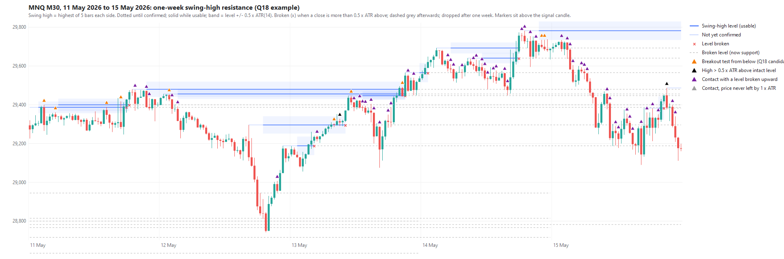

# Q18: do red signals that break horizontal swing-high resistance beat every other signal?

**DRAFT 2026-10-04, not frozen.** Freeze it with the user before any Q18
outcome is computed. All of 2016-2026 and the Q6-Q17 results have been seen,
so this is exploratory.

**The question (the user's option (a)).** A red RTL signal whose buy stop sits
at an intact horizontal resistance level, approached from below, so that a
fill breaks the level. Is that a better trade than every other signal?

**Prior evidence, stated up front:**

- **Q7:** resistance within 1R above the entry (session and week highs) did
  not hurt.
- **Q15:** falling-line candidates whose entry was at or above the line were
  no better than the rest.
- **Q17:** a 0.04-0.05R attribution advantage did not survive a stand-alone
  run.

Expectations are modest.

**Level source in this study:** confirmed M30 **swing highs** whose pivot is in
a rolling **one-week** window (current session plus 5 previous sessions).
Session and week extremes are not used. Every table names the source.

## Definitions: the frozen Q11 machinery, mirrored to highs

Code: [`python/level_resistance.py`](../../python/level_resistance.py). It
applies the frozen Q11 classifier
([`level_visit.py`](../../python/level_visit.py), including its pre-outcome
no-deep-slice amendment) to negated prices, exactly as Q15 mirrored Q14.
Nothing is re-parameterized.

- **A, D:** A = mean of the 14 true ranges before the signal (same contract);
  D = 0.5 x A, taken at the signal. Contract roll and missing-history
  exclusions follow [Q11](../LEVEL_VISIT_PROTOCOL.md).
- **Swing high, N = 5:** a high strictly above the 5 highs before it and at or
  above the 5 after it, same contract. It is known once bar i+5 has closed
  before the signal opens.
- **Levels:** sort the window's known swing highs from highest down. A level
  collects consecutive highs within D of its highest member; level price
  **L = the highest member high**. The zone is L +/- D.
- **State, using closes after the level's latest member and before the
  signal:**
  - *broken* = a close above L + D;
  - *departed* = a close at or below L - A.
  - Closes between L and L + D (false breakouts) do not break the level.
- **Contact:** signal high >= L - D and signal low <= L + D.

## Groups (mutually exclusive, Q11 order and implementation)

1. **Unavailable:** roll, missing history, invalid A.
2. **Breakout test (primary candidate):** contacts an unbroken, departed level,
   and signal high <= L + D. The buy stop at the signal high therefore sits
   within D of the level, so a fill trades at or through it.
3. **Poke-through:** contacts such a level, but the high is already more than D
   above L.
4. **Broken-upward contact:** contacts a level already broken upward, and no
   intact one. This holds both retests from above (role reversal, the user's
   option (b)) and later falls back through the level.
5. **Not-departed contact:** contacts only intact levels that price never left
   by 1 x A.
6. **No contact.**

Primary complement: every other signal. Also report each group and the
available-only complement.

**Descriptive labels (never candidates).** Describe the level nearest the
signal high.

- Inside group 2:
  - *entry at or above L versus below L* (a fill is a strict break only at or
    above);
  - *(high - L) / A* in bins;
  - *opens above L*;
  - *level age*;
  - *merged versus single member*;
  - *false breakouts since the level formed* (closes above L).
- Inside group 4: *true retest* (signal low >= L - D, the level held from
  above) versus *fell back through*.
- *Broad contact* (groups 2-5) is reported as context only. It covers about
  60% of signals, so it cannot be a selective candidate.

## Stage 1: attribution screen (the Q11 gate, unchanged)

**Data.** Same Q10 baseline population, original exit and $1.05 cost:

- periods 2016-2019 and 2020-01-02 to 2026-07-14;
- hash-verified census of 52,070 signals, 35,632 attempts and 14,968 fills;
- 2,000 calendar-month block resamples, seed 20261004.

**Rule.** The primary candidate (one week, N = 5) passes stage 1 only if all
of these hold:

- candidate and complement each have >= 200 fills in both periods;
- candidate PF > 1;
- candidate PF and average net R exceed the complement in both periods;
- average R is better in >= 7 of 11 years (>= 10 fills per group);
- the two-week N = 5 and one-week N = 3 sensitivities point the same way in
  both periods.

## Stage 2: stand-alone run (only if stage 1 passes)

Q17 showed that the attribution screen can mislead, so a stage-1 pass is not a
finding. It only triggers a stand-alone, candidate-only MT5 run, built exactly
as in [Q17](../trendlines/STANDALONE_PROTOCOL.md).

**EA.** The baseline research EA plus an MQL5 gate implementing this level
definition. A non-candidate is rejected like a MaxRedRun rejection: the
pending order is cancelled and none is placed. Same inputs, symbol and
one-minute OHLC, full history.

**Gate check.** A classify-only run must reproduce the stage-1 Python
classification for all 52,070 census signals before any trading run. Any
mismatch is fixed and documented first.

**Reading rule (Q17's, unchanged).** Survives if, in both periods:

- stand-alone PF > 1;
- mean net R > 0;
- mean net R > the baseline full strategy's (-0.004 / +0.060);
- mean R beats the baseline's in >= 7 of 11 years (years with >= 10 trades).

Also report:

- trade identity with the baseline;
- freed and displaced trades;
- the week bootstrap;
- the entry-at-or-above-L label.

## Stopping rule (agreed before outcomes)

If the primary fails stage 1 or stage 2, **level and line research for RTL
stops.** Q6-Q18 have covered:

- session/week extremes;
- swing-low support (revisit, broad contact, weekly low);
- rising and falling trendlines;
- horizontal swing-high breakouts.

No further level or line definition (other N, windows, zones, confluence,
role reversal as a separate candidate) is opened without a new external
reason agreed with the user. A pass at both stages would still adopt nothing
by itself. Combination or sizing would need its own protocol, as after Q17.

## What was seen while drafting (no outcomes)

Classification counts only, from 5,000 sampled signals; no P&L or R. One week,
N = 5:

- about 16.5% of signals are breakout tests in both periods (roughly 960 /
  1,600 fills at the average fill rate);
- 40% are broken-upward contacts;
- 2% are poke-throughs;
- 42% of candidates have their entry at or above L.

Example charts (below) show candidates pressing into intact swing-high levels
from below. The broken-upward group was renamed from "retest" after the charts
showed it also holds falls back through old levels.

## Verification and outputs

- **Unit tests:** [`python/test_level_resistance.py`](../../python/test_level_resistance.py)
  builds resistance scenarios directly from highs. It covers:
  - breakout from below and the boundaries at L +/- D;
  - false breakouts;
  - breaks becoming broken-upward contact;
  - not-departed levels;
  - confirmation timing;
  - merging to the highest member.
- **Stage-1 checks:** independent re-derivation on raw highs (no mirror, no
  study code) for a sample of signals; exact partition reconciliation; hashes
  of inputs, code and this protocol.
- **Outputs:** `Reports/levels/breakout_<date>/`; results doc
  `docs/levels/BREAKOUT_RESULTS.md`; charts from
  `python plot_level_visit_example.py START END --resistance`.
- Stage 1 attributes existing fills only. Execution uses one-minute OHLC; no
  generated ticks.
