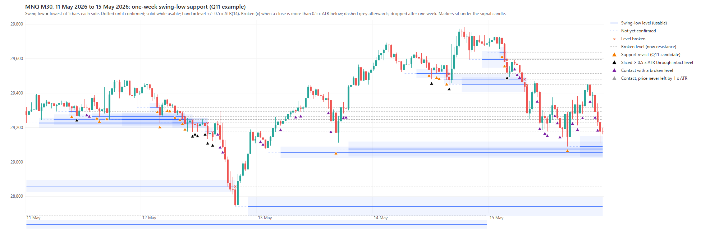

# Q11: red signals at intact one-week M30 swing-low support

2026-10-04 · [Frozen protocol and pre-outcome amendment](../LEVEL_VISIT_PROTOCOL.md) ·
[Analysis](../../python/analyze_level_visit.py) · [Level code](../../python/level_visit.py) ·
[Full tables](../../Reports/levels/level_visit_20261004/report.md).

**Level source in this study:** confirmed M30 swing lows (lowest of 5 bars on
each side) from a rolling one-week window: the current session plus the 5
previous sessions. Two weeks and N = 3 are sensitivities, not alternatives.

## Answer

**Signals that revisit intact swing-low support from above do slightly better
than every other signal in both periods, but the difference is small, every
uncertainty range includes zero, and the N = 3 check does not agree. Under the
frozen rule this is not a candidate for a filtered MT5 run. No filter.**

- The primary setting passes the core rule: at least 200 fills per period, PF > 1,
  and better PF and average R than every other signal in both periods. Average R
  is better in 7 of 11 years, the minimum the rule allows.
- The size is modest: PF +0.11 earlier and +0.04 recently, average net R +0.036
  and +0.005. In 2020–26 the average trade is essentially the same as the rest.
- With N = 3, candidates have a slightly *lower* PF in 2016–19 and the same
  average R in 2020–26. The protocol required the sensitivities to point the
  same way, so the primary result is not taken further.
- The previous-week lead from Q10 is **not** reproduced. Only 66 Q11 candidates
  are also Q10 previous-week interactions; recent swing lows are a different,
  much larger set of levels than the week's lowest price.

## What the levels look like

Example week (11–15 May 2026). Blue lines are usable swing-low levels with their
+/-0.5 x ATR band; red x = broken; dashed grey = broken level afterwards.
Orange = candidate (support revisit), black = sliced more than 0.5 x ATR through
an intact level, purple = contact with a broken level (approached from below).



A [one-month view](img/q11_levels_20260427_20260529.png) is also saved. Charts
are drawn by `python/plot_level_visit_example.py` from the same classification
code; their break marks use each bar's ATR, the study uses the ATR at the signal.

## Main comparison (one week, N = 5, original exit)

| Period | Group | Potential signals | Fills | Net $ | Net PF | Avg net R | Win % |
|---|---|---:|---:|---:|---:|---:|---:|
| 2016–19 | All signals | 19,624 | 5,697 | +6,485 | 1.106 | -0.004 | 43.4 |
| 2016–19 | **Support revisit** | 2,792 | **847** | +2,010 | **1.201** | **+0.027** | 45.5 |
| 2016–19 | Every other signal | 16,832 | 4,850 | +4,475 | 1.087 | -0.010 | 43.0 |
| 2020–26 | All signals | 32,446 | 9,271 | +37,981 | 1.107 | +0.060 | 43.0 |
| 2020–26 | **Support revisit** | 4,651 | **1,454** | +9,419 | **1.140** | **+0.064** | 43.9 |
| 2020–26 | Every other signal | 27,795 | 7,817 | +28,562 | 1.099 | +0.059 | 42.8 |

Support revisit minus every other signal, 95% calendar-month block intervals
(2,000 resamples, seed 20261004, unadjusted):

| Setting | 2016–19 PF diff | 2016–19 avg R diff | 2020–26 PF diff | 2020–26 avg R diff |
|---|---:|---:|---:|---:|
| **One week, N = 5 (primary)** | +0.114 [-0.074, +0.325] | +0.036 [-0.054, +0.131] | +0.042 [-0.112, +0.228] | +0.005 [-0.057, +0.073] |
| Two weeks, N = 5 | +0.054 [-0.149, +0.303] | +0.006 [-0.088, +0.105] | +0.080 [-0.071, +0.261] | +0.019 [-0.045, +0.088] |
| One week, N = 3 | **-0.008** [-0.136, +0.125] | +0.024 [-0.047, +0.093] | +0.035 [-0.122, +0.214] | **-0.000** [-0.062, +0.065] |

Candidate orders convert to fills less often (38.7% / 40.0% versus 43.2% / 42.1%),
as in Q10: the buy stop needs price to recover to the signal high.

## The rest of the population

| Group (one week, N = 5) | 2016–19 fills | PF | Avg R | 2020–26 fills | PF | Avg R |
|---|---:|---:|---:|---:|---:|---:|
| Support revisit (candidate) | 847 | 1.201 | +0.027 | 1,454 | 1.140 | +0.064 |
| Slice-through (> 0.5 x ATR below intact level) | 332 | 1.071 | -0.023 | 497 | **0.941** | +0.018 |
| Broken-level contact (from below) | 1,800 | 1.130 | +0.009 | 2,954 | 1.087 | +0.040 |
| No level contact | 2,242 | 1.097 | -0.016 | 3,624 | **1.191** | +0.088 |
| Window crosses a contract roll | 460 | 0.916 | -0.034 | 717 | 0.991 | +0.013 |

- In 2020–26, signals with **no level nearby** have a higher PF and average R
  than the candidates. The candidate beats "every other signal" recently mainly
  because slice-through and broken-level contacts are weaker, not because
  support signals stand out against signals far from any level.
- Slice-through, the group split off by the amendment, has the lowest PF
  recently. Not-departed contacts are tiny (16 / 24 fills) and not interpreted.
- Contacts from below (purple) are profitable in both periods but no better than
  the rest. That question is logged separately in the inbox.

## Years and drawdown

| Year | Candidate fills | Candidate avg R | Other avg R | Candidate PF | Other PF |
|---|---:|---:|---:|---:|---:|
| 2016 | 245 | -0.199 | -0.098 | 0.856 | 0.988 |
| 2017 | 187 | +0.042 | -0.020 | 1.291 | 1.083 |
| 2018 | 188 | +0.109 | +0.024 | 1.233 | 1.062 |
| 2019 | 227 | +0.190 | +0.058 | 1.409 | 1.186 |
| 2020 | 204 | +0.154 | +0.069 | 1.107 | 1.092 |
| 2021 | 239 | +0.070 | +0.043 | 1.050 | 1.017 |
| 2022 | 246 | +0.034 | +0.045 | 1.009 | 1.085 |
| 2023 | 222 | +0.063 | +0.056 | 1.373 | 1.082 |
| 2024 | 225 | -0.037 | +0.105 | 1.217 | 1.194 |
| 2025 | 210 | +0.118 | +0.019 | 1.289 | 1.028 |
| 2026 (partial) | 108 | +0.057 | +0.093 | 1.041 | 1.226 |

Candidates are about 15% of trades but contribute -$608 of the baseline's
-$1,435 drawdown interval in 2016–19 and -$2,168 of -$4,847 in 2020–26, roughly
40-45% of each. This is attribution inside the existing run, not a backtest of
a support-only or support-excluded strategy.

## Inside the candidate group (descriptive only)

These splits were not specified as candidates and are not selectable. They are
recorded for future questions, with small samples and many comparisons.

- **Level age:** levels set less than a day earlier have PF 1.200 / 1.246; levels
  1-3 days old 1.222 / **0.777** (recent loss of $2,799 on 221 fills).
- **Single swing low vs merged cluster:** PF 1.234 / 1.203 versus 1.162 / 1.058.
- **Undercut depth:** no consistent gradient between near misses, undercuts up
  to 0.25 x ATR and undercuts of 0.25-0.5 x ATR.
- **Earlier closes below the level** (false breakdowns before the signal):
  PF 1.540 / 1.228 on 214 / 345 fills, versus 1.116 / 1.119 without.
- Signals opening below the level: only 18 / 18 fills.

## Verification and limits

- Reused Q10's original-exit census (52,070 potential signals), 35,632 attempts
  and 14,968 fills; counts and net totals ($6,485.15 / $37,980.95) reconcile.
  All signal OHLC values match the M30 reference.
- 12 unit tests cover pivot confirmation and ties, contract checks, merging,
  broken/departed states, contact and undercut boundaries, windows, rolls and
  lagged ATR. An independent direct implementation re-derived the group and
  level of **1,323 sampled signals** across all three settings with no mismatch
  (ties between equidistant levels go to the more recent one, descriptive only).
  All six period/setting partitions reconcile exactly. See `verification.json`.
- One 2020-03-16 signal has no valid ATR (an extreme bar during the March 2020
  crash) and is reported as unavailable.
- All history was already inspected; this is exploratory. The amendment was made
  after viewing classification charts but before any outcome. One-minute OHLC
  execution limits remain. Subgroup PnL is attribution, not a filtered backtest.

Reproduce with the project venv:

```powershell
.\venv\Scripts\python.exe python\analyze_level_visit.py
.\venv\Scripts\python.exe python\verify_level_visit.py
.\venv\Scripts\python.exe -m unittest discover -s python -p test_level_visit.py -v
.\venv\Scripts\python.exe python\plot_level_visit_example.py 2026-05-11 2026-05-16
```
