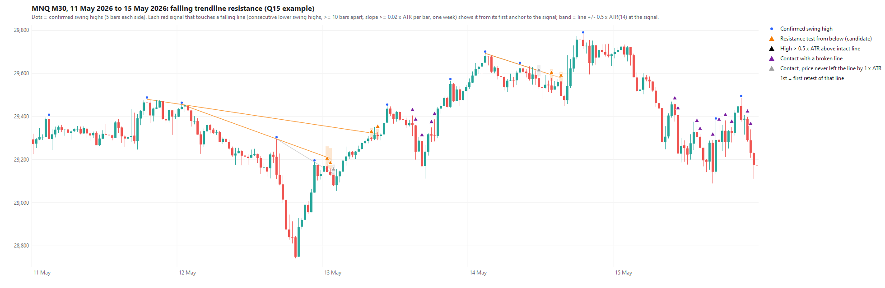

# Q15: red signals at falling trendline resistance

2026-10-04 · [Frozen protocol](RESISTANCE_PROTOCOL.md) ·
[Analysis](../../python/analyze_trendline_resistance.py) · [Line code](../../python/trendline_resistance.py) ·
[Independent check](../../python/verify_trendline_resistance.py) ·
[Full tables](../../Reports/trendlines/trendline_resistance_20261004/report.md).

**Line source in this study:** falling lines through consecutive lower M30
swing highs (highest of 5 bars on each side), both anchors in a rolling
one-week window (the current session plus the 5 previous sessions). Anchors
are at least 10 bars apart, and lines fall at least 0.02 x ATR per bar. Two
weeks and N = 3 are sensitivities.

## Answer

**Yes, by the frozen rule. Red signals that press into an intact falling
resistance line from below do better than every other signal in both periods.
Both sensitivities and broad contact agree. This is the first level or line
definition in Q6-Q15 to pass the gate. It qualifies for a separately
specified full MT5 filter run, nothing more; no rule changes yet.**

- **Primary (one week, N = 5):**
  - PF 1.325 / 1.332 versus 1.088 / 1.090 for every other signal.
  - Average net R +0.093 / +0.110 versus -0.012 / +0.056.
  - 412 / 693 fills; average R better in 8 of 11 years.
- **Sensitivities:** two weeks gives PF 1.344 / 1.431 and N = 3 gives PF
  1.490 / 1.270. Both are better than the rest in both periods.
- **Broad contact** (any unbroken falling line) also passes in all three
  settings: PF 1.292 / 1.282 for the main setting.
- **Uncertainty is still wide.** Only the recent PF difference excludes zero
  (+0.242 [+0.026, +0.480]). The average-R intervals just include zero:
  +0.105 [-0.009, +0.221] earlier and +0.054 [-0.030, +0.132] recently.

**But it is not the breakout the study was named for.** The advantage comes
from candidates whose buy stop sits *below* the line: the red candle reached
into the zone without touching the line (PF 1.412 / 1.548). Candidates whose
entry is at or above the line, where a fill really breaks it, are close to the
rest (PF 1.206 / 1.067, avg R +0.020 / +0.001). This split is descriptive and
was not chosen in advance.

## What the lines look like

Example week (11-15 May 2026). Each line runs from its first anchor to the
signal it classifies; the band is +/-0.5 x ATR at the signal. Orange =
candidate (pressing into the line from below), black = high more than
0.5 x ATR above an intact line, grey = price never left the line by 1 x ATR,
and purple = contact with a line already broken upward (marker only).

A [one-month view](img/q15_resistance_20260427_20260529.png) is also saved.

## Main comparison (one week, N = 5, original exit)

| Period | Group | Potential signals | Fills | Net $ | Net PF | Avg net R | Win % |
|---|---|---:|---:|---:|---:|---:|---:|
| 2016-19 | All signals | 19,624 | 5,697 | +6,485 | 1.106 | -0.004 | 43.4 |
| 2016-19 | **Resistance test** | 1,787 | **412** | +1,485 | **1.325** | **+0.093** | 45.4 |
| 2016-19 | Every other signal | 17,837 | 5,285 | +5,000 | 1.088 | -0.012 | 43.2 |
| 2016-19 | Broad contact | 2,384 | 541 | +1,777 | 1.292 | +0.095 | 46.0 |
| 2016-19 | Available, no contact | 11,025 | 3,330 | +1,728 | 1.053 | -0.030 | 42.2 |
| 2020-26 | All signals | 32,446 | 9,271 | +37,981 | 1.107 | +0.060 | 43.0 |
| 2020-26 | **Resistance test** | 2,793 | **693** | +8,270 | **1.332** | **+0.110** | 44.0 |
| 2020-26 | Every other signal | 29,653 | 8,578 | +29,711 | 1.090 | +0.056 | 42.9 |
| 2020-26 | Broad contact | 3,713 | 893 | +9,278 | 1.282 | +0.098 | 44.5 |
| 2020-26 | Available, no contact | 18,620 | 5,487 | +11,979 | 1.063 | +0.057 | 42.6 |

Candidates fill slightly less often than the rest (fill rate 40.9% / 41.3%
versus 42.6% / 41.8%).

Candidate minus every other signal: 95% calendar-month block intervals
(2,000 resamples, seed 20261004, unadjusted).

| Question / setting | 2016-19 PF diff | 2016-19 avg R diff | 2020-26 PF diff | 2020-26 avg R diff |
|---|---:|---:|---:|---:|
| **Resistance, one week N = 5 (primary)** | +0.237 [-0.041, +0.655] | +0.105 [-0.009, +0.221] | +0.242 [+0.026, +0.480] | +0.054 [-0.030, +0.132] |
| Resistance, two weeks N = 5 | +0.257 [-0.028, +0.673] | +0.113 [-0.009, +0.245] | +0.346 [+0.075, +0.668] | +0.088 [-0.005, +0.180] |
| Resistance, one week N = 3 | +0.418 [+0.181, +0.673] | +0.142 [+0.026, +0.260] | +0.178 [-0.029, +0.383] | +0.050 [-0.028, +0.129] |
| Broad, one week N = 5 | +0.207 [-0.032, +0.516] | +0.109 [+0.015, +0.202] | +0.193 [-0.001, +0.395] | +0.042 [-0.030, +0.112] |
| Broad, two weeks N = 5 | +0.250 [+0.004, +0.582] | +0.128 [+0.026, +0.232] | +0.263 [+0.032, +0.523] | +0.067 [-0.014, +0.146] |
| Broad, one week N = 3 | +0.315 [+0.109, +0.559] | +0.128 [+0.048, +0.215] | +0.221 [+0.020, +0.424] | +0.088 [+0.012, +0.157] |

**Yearly average-R difference (primary, candidate minus rest).**

| Year | 2016 | 2017 | 2018 | 2019 | 2020 | 2021 | 2022 | 2023 | 2024 | 2025 | 2026 |
|---|---:|---:|---:|---:|---:|---:|---:|---:|---:|---:|---:|
| Difference | +0.09 | +0.28 | +0.10 | -0.01 | +0.08 | +0.06 | +0.08 | -0.06 | -0.00 | +0.01 | +0.36 |

## Caveats (post-hoc checks, not part of the gate)

- **2023-2025 show no advantage.** Average R is -0.06 / -0.00 / +0.01 versus
  the rest, and candidate net is $1,780 over those three years.
- **Partial 2026 is large.** Its $3,943 of candidate net comes from 55 trades
  (+0.36 R versus the rest), almost half of the recent $8,270. Excluding 2026,
  2020-25 is still better (PF 1.199 vs 1.086, avg R +0.083 vs +0.055).
- **Not a few outliers.** After removing the 10 best candidate trades (and the
  same share from the rest), PF stays 1.045 / 1.127 versus 0.836 / 0.932.
  Trimming 1% of both R tails keeps the gap (+0.078 vs -0.026; +0.092 vs +0.041).
- **Exits and sizes are similar.** Exit mix and signal range differ only
  slightly from the rest, so the gap is not explained by different stop sizes.

## Inside the candidate group (labels, not candidates)

| Label | 2016-19 fills / PF / avg R | 2020-26 fills / PF / avg R |
|---|---|---|
| Entry below V (high inside the zone, under the line) | 238 / 1.412 / +0.146 | 398 / 1.548 / +0.191 |
| Entry at/above V (fill = break) | 174 / 1.206 / +0.020 | 295 / 1.067 / +0.001 |
| Opens above V | 95 / 1.003 / -0.027 | 163 / 0.962 / -0.058 |
| Opens below V | 317 / 1.410 / +0.129 | 530 / 1.443 / +0.161 |
| High 0.25-0.5 x A above V | 68 / 1.000 / +0.033 | 124 / 0.870 / -0.137 |
| First retest of the line | 18 / 1.336 / -0.284 | 30 / 0.409 / -0.296 |
| Also a Q14 support candidate | 50 / 1.154 / +0.120 | 62 / 1.499 / +0.438 |

The pattern is broadly consistent: the further the signal is above the line,
the weaker it is. Red candles that rise toward a falling line but stay under it,
opening below it, carry the result. First retests are rare (48 of 1,105 fills);
most candidates are later retests of an established line.

These labels are post-hoc descriptions. Under the frozen rule they are not
separate candidates. A follow-up protocol may choose between the full
candidate and a pre-justified narrower version, but must say so before any
new outcome.

## Verification

- Upstream Q10 (11 files) and Q11 (8 files) manifests are hash-verified;
  52,070 signals, 35,632 attempts and 14,968 fills are reproduced.
- 1,323 sampled signals across all groups and settings were re-derived on
  **raw highs**, without the price mirror or the study code: **0 mismatches**
  in group or line value. This also validates the mirroring.
- 9,000 sampled signals match the stand-alone broad classifier. 12 partitions
  reconcile counts, attempts, fills and net; PF and mean R are recomputed from
  the trade ledger.
- No look-ahead: the second anchor is at least N + 1 bars before every signal
  (6 for N = 5, 4 for N = 3). 20 trendline unit tests pass.
- Outputs, input/code/protocol hashes: `Reports/trendlines/trendline_resistance_20261004/`.

## Next step (needs its own protocol, with the user)

A full MT5 run with the falling-line logic in the EA, because skipping signals
changes which later orders can fill. To decide in that protocol:

- the filter: keep only resistance-test signals, or skip everything else;
- whether the entry-below-line pattern may be used (it was seen here first);
- train/test periods and the selection rule.

Consider a Q13-style concentration audit by weekly events first. Execution
uses one-minute OHLC limits; no generated ticks.
