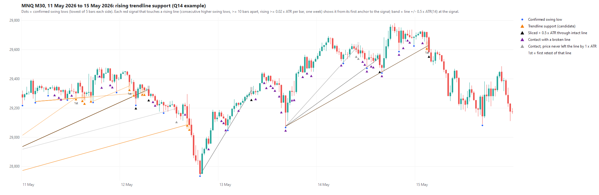

# Q14: red signals at rising trendline support

2026-10-04 · [Frozen protocol](TRENDLINE_PROTOCOL.md) ·
[Analysis](../../python/analyze_trendline_support.py) · [Line code](../../python/trendline_support.py) ·
[Independent check](../../python/verify_trendline_support.py) ·
[Full tables](../../Reports/trendlines/trendline_support_20261004/report.md).

**Line source in this study:** rising lines through consecutive higher M30
swing lows (lowest of 5 bars on each side), both anchors in a rolling one-week
window (the current session plus the 5 previous sessions). Anchors are at
least 10 bars apart, and lines rise at least 0.02 x ATR per bar. Two weeks and
N = 3 are sensitivities.

## Answer

**No. Red signals that revisit an intact rising trendline from above do
*worse* than every other signal in both periods, and lose money in 2020-26.
Broad contact with any unbroken rising line is also worse in both periods.
Neither passes the gate; no filter and no MT5 run.**

- **Primary candidate:** PF 1.029 earlier and **0.950** recently, versus 1.114
  and 1.124 for every other signal. Average net R is 0.029 and 0.038 lower.
  Average R is better in only 5 of 11 years.
- **Sensitivities:** two weeks (PF 1.027 / 0.942) agrees. N = 3 is slightly
  better than the rest in 2016-19 (+0.016 PF) but clearly worse in 2020-26
  (PF 0.942, the only interval excluding zero: -0.186 [-0.338, -0.011]).
- **Broad contact:** PF 1.032 / 0.994 versus 1.122 / 1.131 for every other
  signal, and also below available signals with no line nearby, in both
  periods and in all three settings.
- The sample is adequate (565 / 821 candidate fills, 935 / 1,399 broad). The
  negative result is not caused by a small sample.

## What the lines look like

Example week (11-15 May 2026). Each line runs from its first anchor to the
signal it classifies; the band is +/-0.5 x ATR at the signal. Orange =
candidate, black = sliced more than 0.5 x ATR through, grey = price never left
the line by 1 x ATR, and purple = contact with a broken line (marker only).

A [one-month view](img/q14_trendlines_20260427_20260529.png) is also saved.
Both are drawn by `python/plot_trendline_example.py` from the study code.

## Main comparison (one week, N = 5, original exit)

| Period | Group | Potential signals | Fills | Net $ | Net PF | Avg net R | Win % |
|---|---|---:|---:|---:|---:|---:|---:|
| 2016-19 | All signals | 19,624 | 5,697 | +6,485 | 1.106 | -0.004 | 43.4 |
| 2016-19 | **Trendline support** | 1,977 | **565** | +169 | **1.029** | **-0.030** | 42.7 |
| 2016-19 | Every other signal | 17,647 | 5,132 | +6,316 | 1.114 | -0.001 | 43.5 |
| 2016-19 | Broad contact | 3,252 | 935 | +347 | 1.032 | -0.030 | 43.2 |
| 2016-19 | Available, no contact | 10,257 | 3,064 | +5,513 | 1.167 | -0.000 | 43.2 |
| 2020-26 | All signals | 32,446 | 9,271 | +37,981 | 1.107 | +0.060 | 43.0 |
| 2020-26 | **Trendline support** | 2,985 | **821** | **-1,743** | **0.950** | **+0.025** | 41.2 |
| 2020-26 | Every other signal | 29,461 | 8,450 | +39,724 | 1.124 | +0.063 | 43.2 |
| 2020-26 | Broad contact | 5,015 | 1,399 | -382 | 0.994 | +0.029 | 42.4 |
| 2020-26 | Available, no contact | 17,866 | 5,231 | +21,859 | 1.112 | +0.050 | 42.7 |

Candidate minus every other signal: 95% calendar-month block intervals
(2,000 resamples, seed 20261004, unadjusted).

| Question / setting | 2016-19 PF diff | 2016-19 avg R diff | 2020-26 PF diff | 2020-26 avg R diff |
|---|---:|---:|---:|---:|
| **Support, one week N = 5 (primary)** | -0.085 [-0.280, +0.146] | -0.029 [-0.125, +0.070] | -0.174 [-0.332, +0.018] | -0.038 [-0.127, +0.045] |
| Support, two weeks N = 5 | -0.086 [-0.286, +0.153] | -0.034 [-0.132, +0.066] | -0.182 [-0.350, +0.019] | -0.026 [-0.111, +0.058] |
| Support, one week N = 3 | +0.016 [-0.215, +0.294] | +0.009 [-0.094, +0.117] | -0.186 [-0.338, -0.011] | -0.062 [-0.138, +0.016] |
| Broad, one week N = 5 | -0.090 [-0.264, +0.094] | -0.030 [-0.099, +0.036] | -0.137 [-0.270, +0.018] | -0.036 [-0.099, +0.032] |
| Broad, two weeks N = 5 | -0.086 [-0.270, +0.110] | -0.037 [-0.111, +0.032] | -0.128 [-0.259, +0.028] | -0.028 [-0.091, +0.044] |
| Broad, one week N = 3 | -0.098 [-0.258, +0.058] | -0.019 [-0.088, +0.055] | -0.109 [-0.243, +0.037] | -0.042 [-0.099, +0.015] |

**Yearly average-R difference (primary, candidate minus rest).** 2016 -0.10,
2017 -0.03, 2018 +0.01, 2019 +0.00, 2020 -0.15, 2021 +0.07, 2022 +0.11,
2023 +0.05, 2024 -0.12, 2025 -0.15, 2026 -0.05. Candidates are worse in 6
of 11 years and in each of the last three.

## Other groups (one week, N = 5)

Descriptive only; none of these is a candidate.

| Group | 2016-19 fills / PF / avg R | 2020-26 fills / PF / avg R |
|---|---|---|
| Slice-through (>0.5 x ATR below an intact line) | 331 / 1.046 / -0.055 | 514 / 1.083 / +0.077 |
| Broken-line contact | 1,238 / 1.084 / +0.017 | 1,923 / 1.265 / +0.127 |
| Not departed | 39 / 0.904 / +0.193 | 64 / 0.611 / -0.304 |
| No contact | 3,064 / 1.167 / -0.000 | 5,231 / 1.112 / +0.050 |
| Unavailable (roll, history) | 460 / 0.916 / -0.034 | 718 / 0.967 / +0.011 |

Broken-line contact looks strong recently (PF 1.265) but weaker than no-contact
earlier. It is a mix of unrelated projections, as the charts show. The frozen
rule forbids promoting it.

## Inside the candidate group (labels, not candidates)

Only one label is better than the rest in both periods: anchors more than 46
bars apart (152 / 220 fills, PF 1.385 / 1.163, avg R +0.160 / +0.065). That is
one cell out of 23 examined, small and post hoc. Under the frozen rule it is
not a lead, and other separations are not searched.

Labels that a "classic trendline" view would expect to help do not:

- **First retest (the third touch):** PF 0.756 earlier, 1.016 recently.
- **Wick reaching the line:** PF 1.025 earlier, 0.800 recently.
- **Undercut by 0.25-0.5 x ATR:** PF 1.080 earlier, 0.714 recently.

Only 26% of candidates are also Q11 horizontal support revisits, so this is
largely a different set of signals from Q11. Within the overlap, PF is 1.083 /
0.850. Confluence with horizontal support does not help either.

## Verification

- Upstream Q10 (11 files) and Q11 (8 files) manifests are hash-verified before
  loading; 52,070 signals, 35,632 attempts and 14,968 fills are reproduced.
- 1,323 sampled signals across all groups and settings were re-derived by plain
  loops without importing the study code: **0 mismatches** in group or line value.
- 9,000 sampled signals match the stand-alone broad-contact classifier, and 12
  partitions reconcile counts, attempts, fills and net exactly. 13 unit tests pass.
- **Implementation correction before outcomes.** The first run stopped at the
  broad-contact consistency check, before any outcome was compared. The code had
  put signals touching both a broken and an unbroken, never-departed line into
  "broken contact". The frozen text defines that group as *only* broken lines.
  The code was corrected to the text and a unit test added; the protocol did not change.
- Outputs, input/code/protocol hashes: `Reports/trendlines/trendline_support_20261004/`.

## Limits

- This attributes existing baseline fills; it is not a filtered strategy run.
- The definition is one reasonable trendline construction, frozen in advance.
  Other constructions are not disproven: falling resistance lines, longer
  windows or hand-drawn lines.
- All data had been examined in earlier studies. One-minute OHLC execution
  limits remain.
